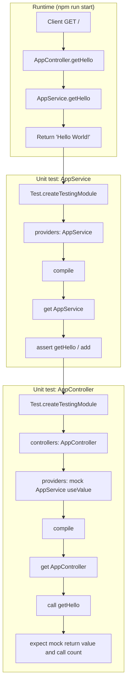

# Test Repo for Writing Unit Tests for Services and Controllers in NestJS

Test repository for writing unit tests for NestJS services and controllers using Jest and NestJS testing utilities.

## Project overview

This project is a minimal NestJS application that demonstrates how to write unit tests for a service and a controller. The service is tested in isolation with no mocked dependencies. The controller is tested with a mocked service so that API request handling can be verified without depending on the real service implementation.

## Features

- **Root HTTP endpoint**: `GET /` returns a greeting string from `AppService`.
- **AppService**: Provides `getHello()` and `add(a, b)` for the controller and for unit tests.
- **AppController**: Single route that delegates to `AppService.getHello()`.
- **Unit tests for AppService**: Tests `getHello()` and `add()` with several cases (positive, zero, negative numbers).
- **Unit tests for AppController**: Uses a mock `AppService` (via `useValue` provider) so the controller is tested in isolation and includes an assertion that the service method is called.
- **Jest**: All tests run with Jest. Configuration is in `jest.config.ts` with `rootDir: "src"` and `*.spec.ts` pattern.
- **NestJS testing utilities**: `Test.createTestingModule()`, `compile()`, and custom providers for mocking.
- **TypeScript**: All source and test code is in TypeScript.

## Dependencies

### Production

- `@nestjs/common`, `@nestjs/core`, `@nestjs/platform-express`: NestJS framework.
- `reflect-metadata`: Required for decorators and dependency injection.
- `rxjs`: Used by NestJS for streams and observables.

### Development

- `@nestjs/cli`: NestJS CLI for build and run (pinned to satisfy security requirements).
- `@nestjs/testing`: Testing utilities (`Test.createTestingModule`, etc.).
- `jest`, `ts-jest`: Test runner and TypeScript support.
- `typescript`, `ts-node`, `tsconfig-paths`: TypeScript compilation and execution.
- `eslint`, `@eslint/js`, `@typescript-eslint/*`, `eslint-config-prettier`, `eslint-plugin-prettier`: Linting and formatting.
- `@types/node`, `@types/express`, `@types/jest`: Type definitions.
- `prettier`: Code formatting.

## Summary of code changes

- **package.json**: Added with NestJS and Jest dependencies, scripts for `start` and `test`, and `engines.node >= 20`.
- **tsconfig.json**: Compiler options with strict typing for the NestJS application.
- **tsconfig.build.json**: Extends main tsconfig and excludes tests and config files from the build.
- **nest-cli.json**: Standard Nest CLI configuration with `sourceRoot: "src"`.
- **src/main.ts**: Bootstraps the NestJS app, enables CORS, listens on `PORT` or 3000.
- **src/app.module.ts**: Root module registering `AppController` and `AppService`.
- **src/app.service.ts**: `getHello()` returns a fixed string. The method `add(a, b)` returns the sum (for unit test examples).
- **src/app.controller.ts**: Single `GET /` handler that returns `appService.getHello()`.
- **src/app.service.spec.ts**: Unit tests for `AppService` using `Test.createTestingModule({ providers: [AppService] })` and assertions on return values and edge cases.
- **src/app.controller.spec.ts**: Unit tests for `AppController` with a mock `AppService` provided via `useValue`. The test checks the response and that the service method is called.
- **jest.config.ts**: Jest config with `rootDir: "src"`, `*.spec.ts` pattern, ts-jest transform, and coverage.
- **eslint.config.mts**: Flat config for TypeScript and Prettier, with Jest globals.

## Request and test flow (flowchart)



## Running the application

1. Install dependencies: `npm install`
2. Start the server: `npm run start`
3. Open or query: `http://localhost:3000/` (default port. Override with the `PORT` environment variable).

## Testing and debugging

- **Run all unit tests**: `npm run test`
- **Run tests in watch mode**: `npm run test:watch`
- **Run tests with coverage**: `npm run test:cov`
- **Debug tests**: `npm run test:debug` (then attach a Node debugger to the process).

Tests live next to the code under `src/*.spec.ts`. No end-to-end or integration tests are included in this minimal repo.

## Linting and formatting

- **Lint**: `npm run lint`
- **Format**: `npm run format`

Fix lint issues before committing.

## Building the application

- **Production build**: `npm run build` (output in `dist/`).
- **Run production build**: `npm run start:prod` (runs `node dist/main`).

## Project structure (file tree)

```text
.
├── src/
│   ├── main.ts
│   ├── app.module.ts
│   ├── app.controller.ts
│   ├── app.controller.spec.ts
│   ├── app.service.ts
│   └── app.service.spec.ts
├── jest.config.ts
├── nest-cli.json
├── tsconfig.json
├── tsconfig.build.json
├── eslint.config.mts
├── eslint-config.d.ts
├── Doxyfile
├── package.json
└── README.md
```

## Design decisions

- **Service tests**: The service has no external dependencies, so the testing module only provides `AppService`. No mocks are needed for the service itself.
- **Controller tests**: The controller depends on `AppService`. Tests replace it with a mock object (`useValue`) so that (1) the controller’s behaviour is tested in isolation and (2) we can assert on the mock (e.g. call count) without touching the real service.
- **Jest**: Used as the test runner and assertion library, matching common NestJS practice.
- **Single module**: No extra feature modules. Everything is in `AppModule` to keep the example focused on unit testing.

## Version and environment requirements

- Node.js: v20 or later (see `engines` in `package.json`).
- TypeScript: strict mode throughout.
